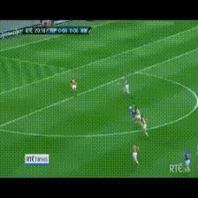

# ActorSL
Official PyTorch implementation of Actor-aware Self-supervised Learning for Semi-supervised Video Representation Learning

# The code will be released soon.

<!-- ### Hurling Sport Actions -->
<!--  -->
<!--  -->
<!-- 
 -->
<!--  -->
<!--  -->

### Hurling Sport Actions
<table>
  <tr>
    <td>
Original Frames
</td>
    <td>
CMPL
</td>
    <td>
ActorSL (Ours)
</td>
  </tr>
  <tr>
    <td></td>
    <td></td>
    <td></td>
   </tr> 
  <tr>
      <td></td>
      <td></td>
      <td></td>
  </tr>
</table>

### Kayaking Action
<table>
  <tr>
    <td>
Original Frames
</td>
    <td>
CMPL
</td>
    <td>
ActorSL (Ours)
</td>
  </tr>
  <tr>
    <td></td>
    <td></td>
    <td></td>
   </tr> 
</table>

### Cricket Shot Action
<table>
  <tr>
    <td>
Original Frames
</td>
    <td>
CMPL
</td>
    <td>
ActorSL (Ours)
</td>
  </tr>
  <tr>
    <td></td>
    <td></td>
    <td></td>
   </tr> 
</table>
